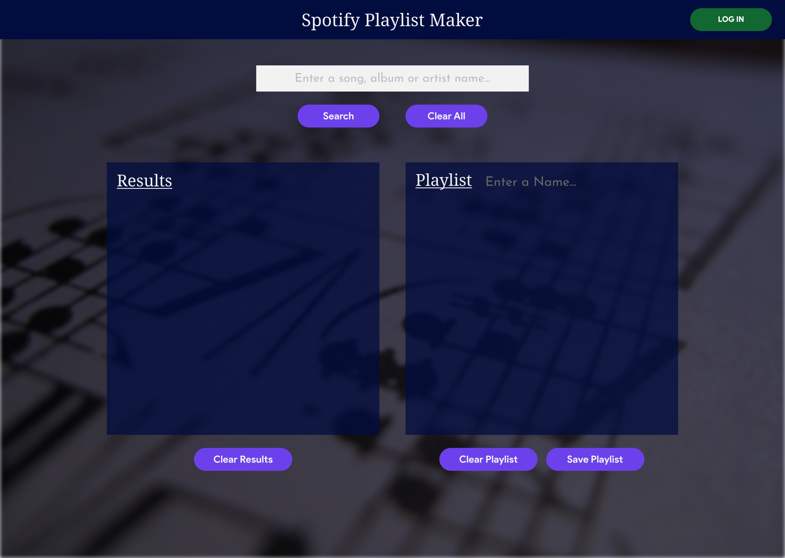

# Spotify Playlist Maker 

## A Spotify playlist utility that was made with `create-react-app`. 

This app uses the following: 

1. React (frontend) 
2. Spotify API's 
3. Netlify (deployment) 

## Site Links 

- [Main Site](https://spotifyplaylistmaker.app) 
- [Netlify Prod](https://spotify-pm.netlify.app) 

## Overview 

This app was originally a small pet project that I was doing for educational purposes, but after starting to use Spotify more, I realized that it was actually pretty handy. Spotify's built-in option for creating playlists is tedious. So I decided to flesh this out and put it out into the wild for others to use. 🙂 

## How It Works 

The interface is straight forward, you enter in a song, album or artist name to search and get back some results (on the left). If you like what you see, then you can add some songs to the playlist (on the right). If not, hit the `clear all` and start again. 

Once you have all the songs you want, you give the playlist a name and hit that `save` button. 

## Technical Shtuff 

Coming Soon... 

## Design Screens 

more
